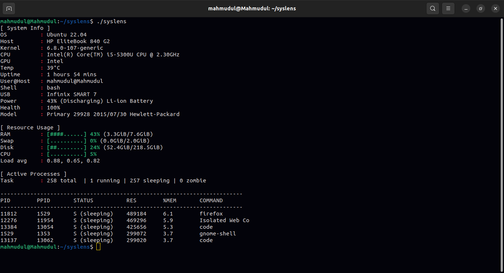

# syslens

syslens is a Linux CLI tool that displays system information in a clean, colorful format.

I'm building this project because I wanted to create something of my own. While many excellent tools already exist, I have always been curious about how they work. I wanted to see if I could build this using my current skills; most of my projects are a way for me to test and improve myself, and this is one of them.

### How to use it

After cloning or downloading this repo, open the syslens folder in your terminal and type make. This will create an executable file named syslens. Then, simply run ./syslens and press enter to see your system information.

### Screenshot
