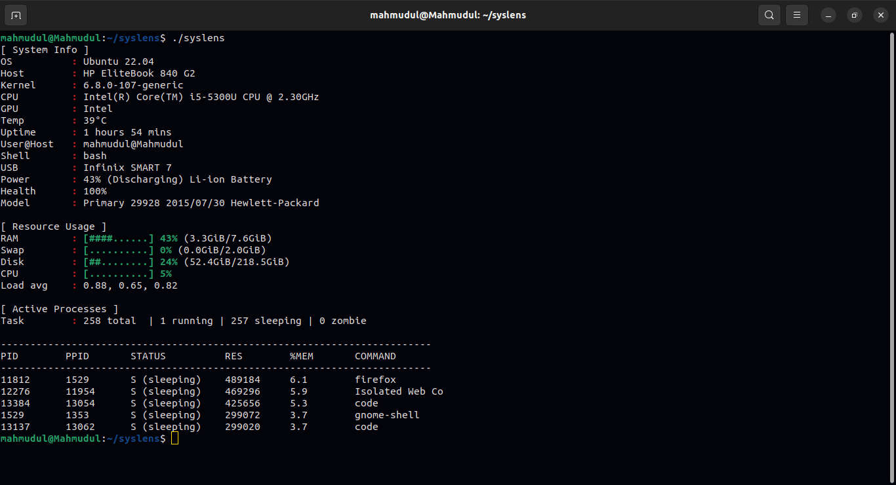

# SysLens 🔍

[](https://opensource.org/licenses/MIT)
[]()
[](https://github.com/mahmudul626/syslens/stargazers)


SysLens is a lightweight, terminal-based system information utility written in C. It leverages Linux's virtual filesystems and system files to produce a real-time snapshot of system health, hardware specifications, and resource usage.

## 🚀 Features

- **System Overview:** Displays OS name, kernel version, CPU model, GPU information, temperature, uptime, current user, shell, product name, USB devices, and power supply details.
- **Resource Monitoring:** Provides visual progress bars for RAM, swap, and disk usage, with color-coded alerts (green/yellow/red) for critical levels. Includes CPU usage percentage and load averages.
- **Process Statistics:** Summarizes total tasks along with counts of running, sleeping, and zombie processes. Displays top memory-consuming processes.
- **Hardware Monitoring:** Shows battery health and status for laptop systems.
- **Performance Metrics:** Real-time system load averages over 1, 5, and 15 minutes.
- **Lightweight & Fast:** Consumes minimal memory and runs without external dependencies.

## Screenshots



## �📂 Project Structure

The repository is organized as follows:

```
syslens/
├── include/
│   └── main.h        # Header definitions and function prototypes
├── src/
│   ├── main.c        # Program entry point and argument parsing
│   ├── mem.c         # Memory, disk, and load average logic
│   ├── proc.c        # Process parsing logic (/proc handling)
│   └── sys.c         # OS and hardware info logic
├── LICENSE           # MIT License
├── Makefile          # Build automation script
└── README.md         # This documentation
```

## 🛠 Installation

### Prerequisites

- Linux-based operating system
- `gcc` compiler
- `make` utility

### Build from source

1. Clone or download the repository.
2. Enter the project directory:
   ```bash
   cd syslens
   ```
3. Compile the program:
   ```bash
   make
   ```

### System-wide installation

To install `syslens` so it can be run from anywhere:

```bash
sudo make install
```

## 📖 Usage

Running without arguments displays all available information. Flags can be used to show specific sections:

| Command            | Description                                         |
|---------------------|-----------------------------------------------------|
| `syslens`           | Show all system, resource, and process info        |
| `syslens -s`        | Show only system info (OS, kernel, CPU, GPU, etc.) |
| `syslens -m`        | Show resource usage (RAM, swap, disk, load average)|
| `syslens -p`        | Show active process statistics                     |
| `syslens --version` | Display the current version                        |
| `syslens --help`    | Display the help menu                              |

## ⚙️ How it works

SysLens reads data from the Linux kernel's virtual `/proc` filesystem and other system files:

- **CPU & Hardware:** Parsed from `/proc/cpuinfo`, `/sys/class/dmi/id/product_name`, and GPU info from system files.
- **Memory & Disk:** Information from `/proc/meminfo` and `statvfs` system call for disk usage calculations.
- **Processes:** Iterates over PID directories under `/proc` and reads their `/status` files.
- **Uptime & Load:** Parsed from `/proc/uptime` and `/proc/loadavg`.
- **Power & Battery:** Reads from `/sys/class/power_supply/` for battery and power information.
- **USB Devices:** Enumerates devices from `/sys/bus/usb/devices/`.
- **Temperature:** Reads thermal zone information from `/sys/class/thermal/`.

## 🧹 Uninstallation

To remove the installed binary from the system:

```bash
sudo make uninstall
```

## 🤝 Contributing

Contributions are welcome! Please feel free to submit a Pull Request. For major changes, please open an issue first to discuss what you would like to change.

## 📄 License

This project is licensed under the MIT License - see the [LICENSE](LICENSE) file for details.

## 📊 Development

- **Version:** 1.0.3
- **Language:** C
- **Platform:** Linux
- **Dependencies:** None (uses only standard C libraries and system files)

---

*SysLens - Keep an eye on your system's vital signs!*

